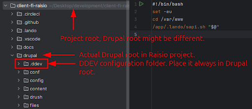
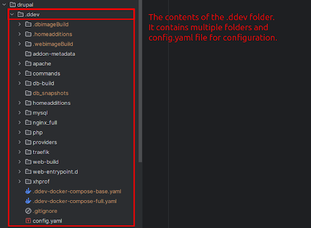
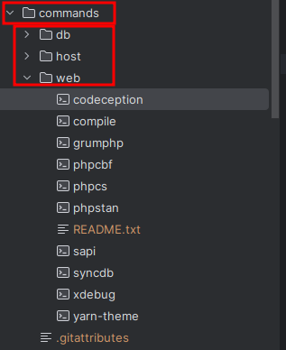
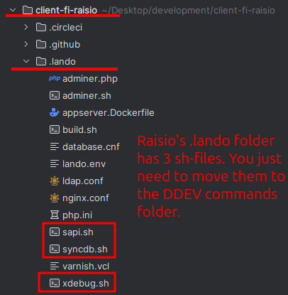
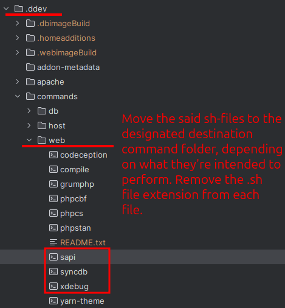

# Rollout - Lando to DDEV upgrade

This document describes the process of upgrading Lando to DDEV as the local development environment for Wunder’s projects.

## 1. Installing DDEV

#### Install DDEV to your machine. Available for both Ubuntu and Apple.

As Lando is getting outdated, we’re moving towards DDEV as a better and up-to-date solution for local development. Installing DDEV is a quite straightforward process. This document provides steps on how to install DDEV on your local machine and to integrate old Lando environments into DDEV environments.

### 1.1 DDEV installation for Linux

To install DDEV for Ubuntu Debian, follow these steps:

```shell
# Add DDEV’s GPG key to your keyring
sudo sh -c 'echo ""'
sudo apt-get update && sudo apt-get install -y curl
sudo install -m 0755 -d /etc/apt/keyrings
curl -fsSL https://pkg.ddev.com/apt/gpg.key | gpg --dearmor | sudo tee /etc/apt/keyrings/ddev.gpg > /dev/null
sudo chmod a+r /etc/apt/keyrings/ddev.gpg

# Add DDEV releases to your package repository
sudo sh -c 'echo ""'
echo "deb [signed-by=/etc/apt/keyrings/ddev.gpg] https://pkg.ddev.com/apt/ * *" | sudo tee /etc/apt/sources.list.d/ddev.list >/dev/null

# Update package information and install DDEV
sudo sh -c 'echo ""'
sudo apt-get update && sudo apt-get install -y ddev

# One-time initialization of mkcert
mkcert -install
```

### 1.2 DDEV installation for Apple

To install DDEV for Apple Homebrew, follow these steps:

```shell
# Install DDEV
brew install ddev/ddev/ddev
# One-time initialization of mkcert
mkcert -install
```

Or alternatively:

```shell
# Download and run the install script
curl -fsSL https://ddev.com/install.sh | bash
ddev start
```
## 2. Setting up the DDEV for a project

#### Set up the DDEV for your project.
Setting up the DDEV for your project as a local development environment is a little trickier than the installation. Ensure the root of your actual Drupal project, as depending on the project, it might not be in the actual root of the project, but, e.g., in a subdirectory called `drupal/`.

### 2.1 Steps to be taken

1. To commence, `cd` into the existing project directory. Ensure that you’re in the actual Drupal root, as this might not always be the root of the project.
2. Run `ddev config` to initialize a DDEV project. 
3. Run `ddev start` to spin up the project. 
4. Run `ddev launch` to launch the project in a web browser. This is the same command as `lando start` in Lando environment.

See the images below for an example of a DDEV project. The project in question is Raisio.





## 3. Lando tooling -> DDEV commands

#### The DDEV commands perform the same function as the toolings in Lando.

As DDEV is not configured in a single yaml-file, but instead in `.ddev`-folder, the integration of tooling is a bit different in DDEV than in Lando.

### 3.1 Commands in DDEV

The commands are located in the `.ddev`-folder's `commands` subfolder. DDEV automatically generates 3 folders where you can create commands: `db`, `host` and `web`.



In Lando, toolings were used to execute different actions in the local development environment, e.g. Codeception tests. These toolings are placed in .lando.yml-configuration file under the toolings section.

Below is an example of a Codeception tooling (taken from Raisio’s `.lando.yml`):

```yml
toolings:
  codeception:
    cmd:
      - appserver: "./vendor/bin/codecept --env=lando"
    description: "Run codeception tests"
    dir: "/app/drupal"
```

The command files are bash files. They’re marked as bash files, and their documentation consists of description, usage and example. You may also add a see part for relevant documentation, e.g. a documentation related to the said bash file.

Below is an example command for [Codeception](https://codeception.com/) tests:

```shell
#!/bin/bash
## Description: Run Codeception PHP tests
## Usage: codeception
## Example: ddev codeception

#
# Helper script to run codeception tests
#
# Usage:
# ddev codeception
# See: https://codeception.com/
#

set -eu
cd /var/www/html
./vendor/bin/codecept --env=ddev "$@"
```

### 3.2 sh-files in Lando and in DDEV
In Lando projects, there might be custom sh or bash files that contain custom commands to perform different actions, e.g. database synchronisation from the cloud environment.

In order for you to integrate these to DDEV environment, you just need to copy the sh-files from the lando folder to your DDEV commands folder. Please take a look at the next 2 screenshots from Raisio project:




These scripts may not be directly run as they were in .lando-directory. As an example, see the file **sapi** in DDEV web commands folder, as it was copied directly from .lando-directory:

```shell
#!/bin/bash
set -exu

PATH="/app/drupal/vendor/bin:$PATH"

cd /app/drupal/web

# # Rebuild the tracker for an index.
drush search-api:rebuild-tracker

# # Index all search items.
drush search-api:index
```

If you try and run `ddev sapi`, it would not run successfully, as the PATH refers to a faulty address in DDEV folder’s point of view, same applying with the cd command. Instead you should change these two addresses to match the current directory structure.

See below the fixed code for **sapi**:

```shell
#!/bin/bash
set -exu

PATH="/var/www/html/vendor/bin:$PATH"

cd /var/www/html/web

# # Rebuild the tracker for an index.
drush search-api:rebuild-tracker

# # Index all search items.
drush search-api:index 
```

As we moved to a DDEV environment, the project root is bound to `/var/www/html`, not `/app`. This is why the `/app/drupal/web` was changed to `/var/www/html`, as was done in the example code. Now running `ddev sapi` will result in a successfully run shell script.

## Sources cited:

 - **DDEV Installation.** https://docs.ddev.com/en/stable/users/install/ddev-installation/
 - **Starting a Project.** https://docs.ddev.com/en/stable/users/project/
 - **Commands.** https://docs.ddev.com/en/stable/users/usage/commands/#add-on